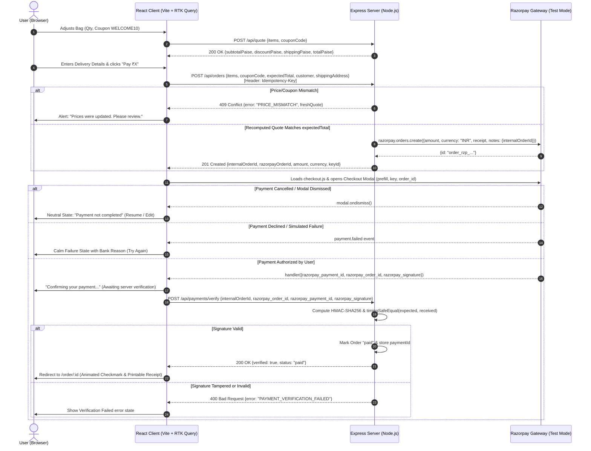

# Meridian — Quiet-Luxury Payments Checkout

A production-grade, accessible, and mathematically sound fintech payments checkout flow integrating **Razorpay Standard Checkout** in **Test Mode**. Engineered for a fictional luxury workspace accessories store called _Meridian_.

Built as an exemplary full-stack fintech portfolio project with strict guarantees around **cryptographic verification**, **server-authoritative pricing**, **WCAG 2.2 AA accessibility**, and **quiet-luxury design aesthetics**.

---

## Architecture Sequence Diagram

The checkout architecture enforces server-side pricing recalculation, integer-paise calculations, idempotency, and constant-time signature verification.



---

## Security Decisions & Fintech Guarantees

1. **Server-Authoritative Pricing (No Client Price Trust)**:
   The client sends only `{ productId, quantity }` and optional `couponCode`. The server recalculates every amount directly from its internal catalog. Even when creating an order, `expectedTotal` is validated; any mismatch returns a `409 Conflict` with the fresh quote.
2. **Integer Paise Representation Everywhere**:
   All amounts in APIs, models, discount math, and gateway payloads are integer paise (`₹1.00 = 100 paise`). Currency symbols and decimal formatting only occur at display render time via `Intl.NumberFormat("en-IN")`. Floating-point arithmetic errors (`0.1 + 0.2 !== 0.3`) are eliminated.
3. **Constant-Time Signature Verification (`crypto.timingSafeEqual`)**:
   Razorpay signatures are verified by calculating `HMAC-SHA256(razorpay_order_id + "|" + razorpay_payment_id, RAZORPAY_KEY_SECRET)`. Before comparing, both buffers are checked for strictly equal lengths (preventing `timingSafeEqual` exceptions) and evaluated in constant time to thwart side-channel timing attacks.
4. **Credential Isolation**:
   The Razorpay Key Secret is exclusively loaded in the backend environment. Only the public Key ID (`rzp_test_...`) ever reaches the browser client.
5. **Idempotency Protection**:
   `POST /api/orders` supports an `Idempotency-Key` request header. Double-clicks or network retries return the previously generated order without calling Razorpay repeatedly.
6. **Defensive API Hardening**:
   - `helmet` security headers
   - Strict CORS origin whitelisting matching `CLIENT_ORIGIN`
   - Payload size limit (`100kb`)
   - Route rate limiting on order creation (`30 req / 15m`) and payment verification (`40 req / 15m`)
   - Centralized error handler returning normalized JSON `{ error: { code, message } }` with zero stack-trace leakage.

---

## Test-Mode Payment Credentials

In Razorpay Test Mode, no actual financial transactions or charges occur. Use the following test instruments:

| Payment Method     | Test Details                                                                                        | Expected Behavior                                                                            |
| :----------------- | :-------------------------------------------------------------------------------------------------- | :------------------------------------------------------------------------------------------- |
| **Card (Success)** | `4111 1111 1111 1111`<br/>Expiry: Any future date (e.g. `12/28`)<br/>CVV: Any 3 digits (e.g. `123`) | Enters OTP simulation screen. Submitting completes successful payment and verification.      |
| **UPI (Success)**  | `success@razorpay`                                                                                  | Simulates an instant approved UPI notification.                                              |
| **UPI (Failure)**  | `failure@razorpay`                                                                                  | Simulates a declined UPI request and triggers the failure state.                             |
| **Netbanking**     | Any listed bank (e.g. HDFC, ICICI, SBI)                                                             | Opens an interactive Razorpay bank portal with distinct **Success** and **Failure** buttons. |

> **Note on Test Mode UPI Cancellation**: In the Razorpay sandbox, cancelling a UPI request on external simulators can occasionally be marked successful by the mock gateway. For testing cancellation / dismissal, close the checkout modal using the top-right &times; button or test card cancellation.

---

## Tech Stack & Architecture

- **Monorepo**: npm workspaces (`/client` and `/server`).
- **Client**:
  - Vite + React 19 + TypeScript (strict mode, `noUncheckedIndexedAccess`).
  - React Router (route-level code splitting via `React.lazy` and `Suspense`).
  - Redux Toolkit + RTK Query for caching and API lifecycle.
  - `react-hook-form` + `zod` resolver with on-blur validation for contact and Indian addresses.
  - `framer-motion` for spring-physics step transitions and drawn-in checkmark (honors `prefers-reduced-motion`).
  - `lucide-react` for accessible iconography.
  - Vanilla SCSS with CSS Modules (`.module.scss`) and CSS custom property design tokens (no Tailwind, no third-party UI library).
  - Self-hosted variable typography (`@fontsource-variable/plus-jakarta-sans` and `@fontsource-variable/inter`).
- **Server**:
  - Node 20+, Express, TypeScript (ESM).
  - Official `razorpay` Node SDK.
  - `zod` for request schema validation and fail-fast environment variable parsing.
  - `helmet`, `cors`, `express-rate-limit`, `node:crypto`.
  - In-memory repository with clean swappable `IOrderRepository` interface.
- **Testing**:
  - Vitest + React Testing Library + `@testing-library/jest-dom` + `supertest`.
  - Coverage with `@vitest/coverage-v8` (over 90% across core pricing and payment verification modules).

---

## Environment Variables

### Backend (`server/.env`)

| Variable                  | Required | Default / Example       | Purpose                                           |
| :------------------------ | :------: | :---------------------- | :------------------------------------------------ |
| `PORT`                    |    No    | `5000`                  | Port for the Express HTTP server                  |
| `CLIENT_ORIGIN`           |   Yes    | `http://localhost:5173` | Allowed CORS origin for frontend                  |
| `RAZORPAY_KEY_ID`         |   Yes    | `rzp_test_...`          | Public Key ID from Razorpay Dashboard             |
| `RAZORPAY_KEY_SECRET`     |   Yes    | `...`                   | Secret Key from Razorpay Dashboard (Never commit) |
| `RAZORPAY_WEBHOOK_SECRET` |    No    | `...`                   | Webhook secret for raw HMAC validation            |
| `NODE_ENV`                |    No    | `development`           | Application runtime environment                   |

### Frontend (`client/.env`)

| Variable       | Required | Default / Example       | Purpose                                                |
| :------------- | :------: | :---------------------- | :----------------------------------------------------- |
| `VITE_API_URL` |    No    | `http://localhost:5000` | Base URL for backend API (in dev, Vite proxies `/api`) |

---

## Setup & Local Development

### 1. Prerequisites

- Node.js 20+ installed
- Razorpay account (Free sign-up at [dashboard.razorpay.com](https://dashboard.razorpay.com/app/keys)) to obtain Test Key ID and Secret.

### 2. Clone and Install

```bash
git clone <repository-url>
cd new_react_proj
npm install
```

### 3. Configure Environments

Copy the environment examples:

```bash
cp server/.env.example server/.env
cp client/.env.example client/.env
```

Fill in your `RAZORPAY_KEY_ID` and `RAZORPAY_KEY_SECRET` in `server/.env`.

### 4. Run Both Client & Server in Dev Mode

```bash
npm run dev
```

- Client starts at `http://localhost:5173`
- Server starts at `http://localhost:5000`

---

## Running Verification Commands

Run all checks from the root directory across all workspaces:

```bash
# Typecheck TypeScript strictly
npm run typecheck

# Lint with ESLint and jsx-a11y
npm run lint

# Run all automated tests (client + server)
npm run test

# Run server test coverage
npm run test:coverage --workspace=server

# Run production build
npm run build
```

---

## API Reference

### Catalog & Pricing

- `GET /api/health`: Health status and service timestamp.
- `GET /api/products`: Full seeded product catalog.
- `POST /api/quote`:
  - Body: `{ items: [{ productId, quantity }], couponCode?: string }`
  - Returns calculated line items, subtotal, discount, shipping, total in paise, and coupon status.

### Orders & Payment

- `POST /api/orders`:
  - Header: `Idempotency-Key` (optional, recommended)
  - Body: `{ items, couponCode?, expectedTotal, customer: { name, email, phone }, shippingAddress: { line1, line2?, city, state, pincode } }`
  - Returns `{ internalOrderId, razorpayOrderId, amount, currency, keyId }`
  - Status `409` on price mismatch with fresh quote.
- `POST /api/payments/verify`:
  - Body: `{ internalOrderId, razorpay_order_id, razorpay_payment_id, razorpay_signature }`
  - Returns `{ verified: true, status: "paid" }` or `400` on signature mismatch.
- `GET /api/orders/:id`:
  - Returns sanitized receipt summary for the confirmation page.
- `POST /api/webhooks/razorpay`:
  - Receives raw JSON payload with `X-Razorpay-Signature` header. Idempotently captures `payment.captured` and `payment.failed`.

---

## Deployment Configuration

### Frontend (Vercel / Netlify / Cloudflare Pages)

1. Set Root Directory to `client`.
2. Build Command: `npm run build`
3. Output Directory: `dist`
4. Set Environment Variable: `VITE_API_URL=https://your-backend-domain.com`

### Backend (Render / Railway / Fly.io)

1. Set Root Directory to `server`.
2. Build Command: `npm run build`
3. Start Command: `npm run start`
4. Set Environment Variables:
   - `PORT=5000`
   - `CLIENT_ORIGIN=https://your-frontend-domain.com`
   - `RAZORPAY_KEY_ID=rzp_test_...`
   - `RAZORPAY_KEY_SECRET=...`

---

## Known Limitations & Production Roadmap

1. **In-Memory Order Storage**:
   The current implementation uses an in-memory repository implementing `IOrderRepository`. Data resets on server restart. For persistent production, swap in PostgreSQL or MySQL with Prisma/Drizzle.
2. **Asynchronous Webhook Queue**:
   In high-throughput environments, Razorpay webhooks should be enqueued into Redis/BullMQ to absorb spikes and guarantee retry processing.
3. **Automated Tax Invoicing**:
   Generating GST-compliant PDF invoices using headless Chromium or PDFKit and dispatching via SendGrid/SES.
